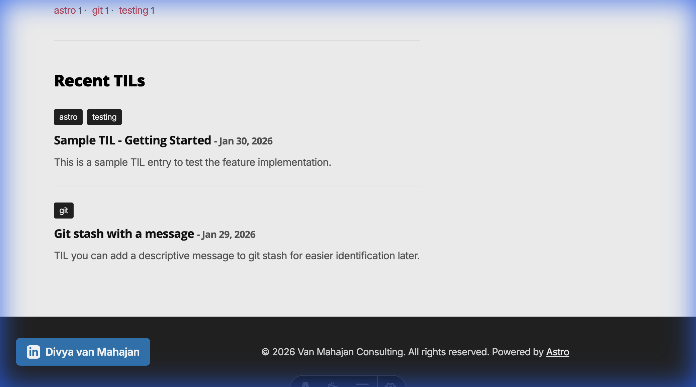
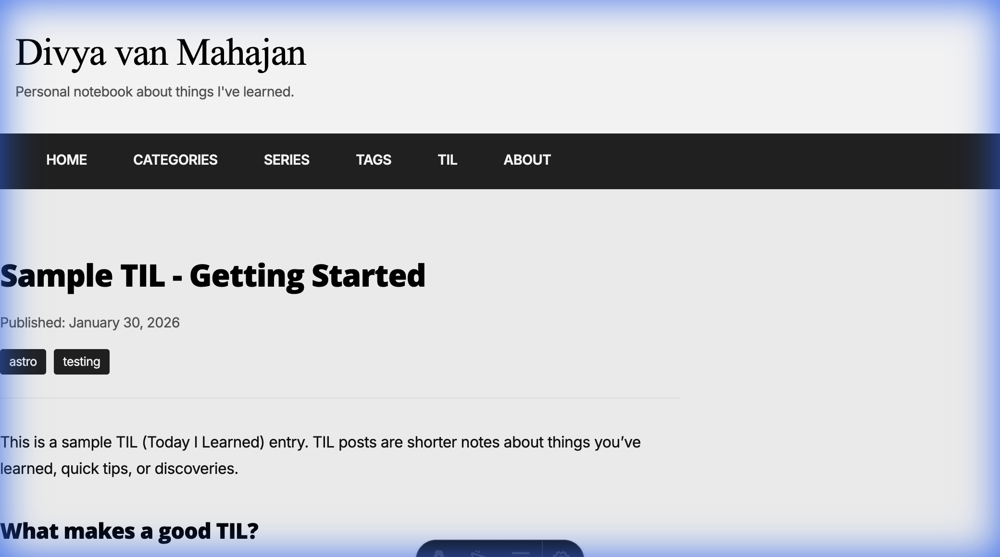
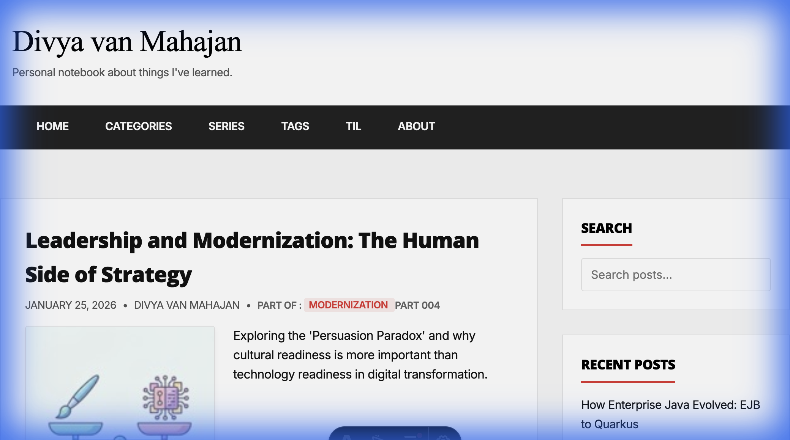

# TIL Feature Walkthrough

## Summary

Successfully implemented a "Today I Learned" (TIL) section for the blog. The feature provides a lightweight space for quick notes and learnings.

## Changes Made

### Content Collection
- Added `til` collection to `src/content/config.ts` with simplified schema

### Navigation
- Added "TIL" link to `src/components/Header.astro`

### New Pages

| Page | Path | Description |
|------|------|-------------|
| Index | `/til/` | Tag cloud and recent TILs |
| Post | `/til/[slug]/` | Individual TIL entries |
| Tag Filter | `/til/tags/[tag]/` | Filtered TIL list |
| RSS Feed | `/til/rss.xml` | Atom feed |

---

## Screenshots

### TIL Index Page


### Individual TIL Post


### Navigation Header


---

## Creating New TIL Entries

Add a markdown file to `src/content/til/YYYY/MM/your-til-name.md`:

```yaml
---
title: "Your TIL Title"
description: "Brief description"
pubDate: 2026-01-30
tags: ["tag1", "tag2"]
---

Your content here...
```

## Related Issues

- #6 - Parent issue
- #7-12 - Component sub-issues
